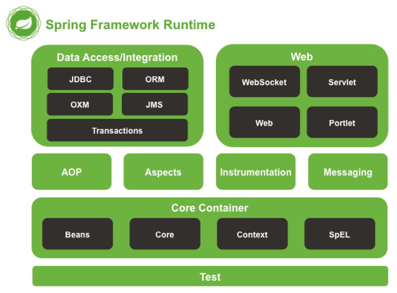
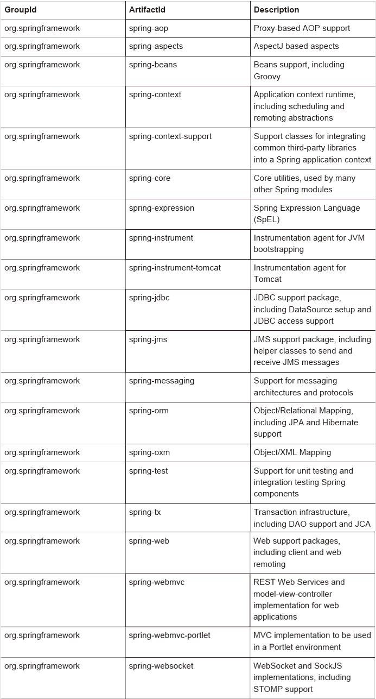

# 000.Spring Modules

## Core Container

* spring-core and spring-beans

provide the fundamental parts of the framework, including the IoC and Dependency Injection features. The BeanFactory is a sophisticated implementation of the factory pattern.

* spring-context

builds on the solid base provided by the Core and Beans modules: it is a means to access objects in a framework-style manner that is similar to a JNDI registry. The ApplicationContext interface is the focal point of the Context module.

* springcontext-support

provides support for integrating common third-party libraries into a Spring application context for caching (EhCache, Guava, JCache), mailing (JavaMail), scheduling (CommonJ, Quartz) and template engines (FreeMarker, JasperReports, Velocity)

* spring-expression

provides a powerful Expression Language for querying and manipulating an object graph at runtime. It is an extension of the unified expression language (unified EL) as specified in the JSP 2.1 specification.

## Data Access/Integration

The Data Access/Integration layer consists of the JDBC, ORM, OXM, JMS, and Transaction modules.

* spring-jdbc

provides a JDBC-abstraction layer that removes the need to do tedious JDBC coding and parsing of database-vendor specific error codes.

* spring-tx

supports programmatic and declarative transaction management for classes that implement special interfaces and for all your POJOs (Plain Old Java Objects).

* spring-orm

provides integration layers for popular object-relational mapping APIs, including JPA, JDO, and Hibernate. Using the spring-orm module you can use all of these O/Rmapping frameworks in combination with all of the other features Spring offers, such as the simple declarative transaction management feature mentioned previously.

* spring-oxm

provides an abstraction layer that supports Object/XML mapping implementations such as JAXB, Castor, XMLBeans, JiBX and XStream.

* spring-jms

contains features for producing and consuming messages. Since Spring Framework 4.1, it provides integration with the spring-messaging module.

## Web

* spring-web

provides basic web-oriented integration features such as multipart file upload functionality and the initialization of the IoC container using Servlet listeners and a web-oriented application context. It also contains an HTTP client and the web-related parts of Spring’s remoting support.

* spring-webmvc

contains Spring’s modelview- controller (MVC) and REST Web Services implementation for web applications. Spring’s MVC framework provides a clean separation between domain model code and web forms and integrates with all of the other features of the Spring Framework.

* spring-webmvc-portlet

provides the MVC implementation to be used in a Portlet environment and mirrors the functionality of the spring-webmvc module.

## AOP

* spring-aop

provides an AOP Alliance-compliant aspect-oriented programming implementation allowing you to define, for example, method interceptors and pointcuts to cleanly decouple code that implements functionality that should be separated.

* spring-aspects

provides integration with AspectJ

## Instrumentation

* spring-instrument

provides class instrumentation support and classloader implementations to be used in certain application servers. The spring-instrument-tomcat module contains Spring’s instrumentation agent for Tomcat.

## Messaging

* spring-messaging

Spring Framework 4 includes a spring-messaging module with key abstractions from the Spring Integration project such as Message, MessageChannel, MessageHandler, and others to serve as a foundation for messaging-based applications. The module also includes a set of annotations for mapping messages to methods, similar to the Spring MVC annotation based programming model.

## Test

* spring-test

supports the unit testing and integration testing of Spring components with JUnit or TestNG. It provides consistent loading of Spring ApplicationContexts and caching of those contexts. It also provides mock objects that you can use to test your code in isolation.

# Spring Framework Artifacts

