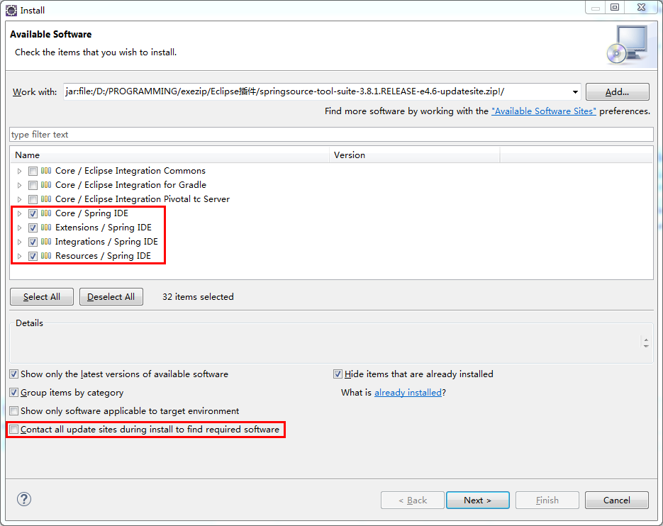
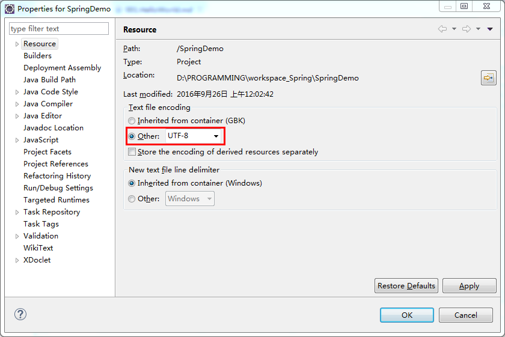
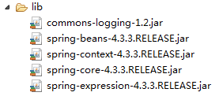
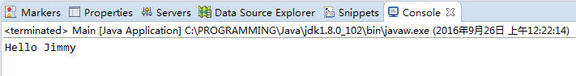
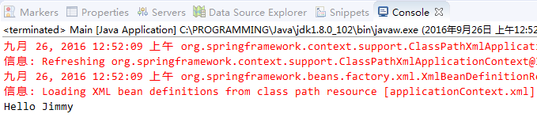

# 001.HelloWorld

## 一、环境

* Spring 4.3.3 [Link](http://repo.springsource.org/libs-release-local/org/springframework/spring/4.3.3.RELEASE/)

* Spring Tool Suite 3.8.1 [Link](https://spring.io/tools/sts/all)

## 二、步骤

* 安装Spring Tool Suite 3.8.1

* 创建Java项目并设置文件编码，此例为“SpringDemo”

* 创建lib文件夹，导入必需的Spring jar包和commons-logging jar包

* 创建包com.jimmy.spring.beans

* 新建类HelloWorld

		package com.jimmy.spring.beans;
		
		public class HelloWorld {
			
			private String name;
			
			public void setName(String name) {
				this.name = name;
			}
			
			public void hello() {
				System.out.println("Hello " + name);
			}
			
		}

* 新建类Main

		package com.jimmy.spring.beans;
		
		public class Main {
		
			public static void main(String[] args) {
				
				//创建HelloWorld实例
				HelloWorld hw = new HelloWorld();
				//对Name属性赋值
				hw.setName("Jimmy");
				//调用hello方法
				hw.hello();
				
			}
		
		}

* 运行Main方法，控制台输出结果

* 添加Spring Bean Configuration File -- applicationContext.xml，并配置bean

		<?xml version="1.0" encoding="UTF-8"?>
		<beans xmlns="http://www.springframework.org/schema/beans"
			xmlns:xsi="http://www.w3.org/2001/XMLSchema-instance"
			xsi:schemaLocation="http://www.springframework.org/schema/beans http://www.springframework.org/schema/beans/spring-beans.xsd">
		
			<!-- 配置bean -->
			<!-- Spring以反射的方式创建HelloWorld实例 -->
			<bean id="helloWorld" class="com.jimmy.spring.beans.HelloWorld">
				<!-- 对应setName方法 -->
				<property name="name" value="Jimmy"></property>
			</bean>
		
		</beans>

* 修改Main方法，把部分工作交由Spring完成

		package com.jimmy.spring.beans;
		
		import org.springframework.context.ApplicationContext;
		import org.springframework.context.support.ClassPathXmlApplicationContext;
		
		public class Main {
		
			public static void main(String[] args) {
				
				/*//创建HelloWorld实例
				HelloWorld hw = new HelloWorld();
				//对Name属性赋值
				hw.setName("Jimmy");
				//调用hello方法
				hw.hello();*/
				
				//创建Spring的IOC容器对象
				ApplicationContext ctx = new ClassPathXmlApplicationContext("applicationContext.xml");
				//从IOC容器中获取Bean实例
				HelloWorld hw = (HelloWorld) ctx.getBean("helloWorld");
				//调用hello方法
				hw.hello();
				
			}
		
		}

* 运行Main方法，控制台输出相同结果

