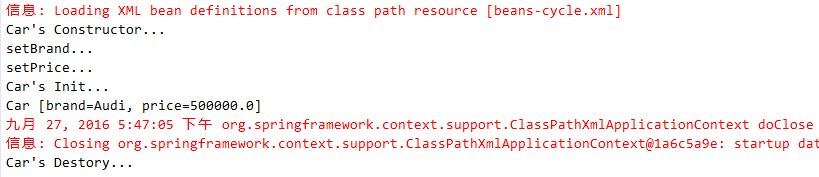
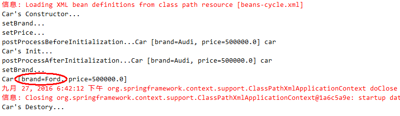

# 009.管理Bean的生命周期

## 一、管理Bean的生命周期

* 创建Car类

		package com.jimmy.spring.beans.cycle;
		
		public class Car {
			
			private String brand;
			private double price;
			
			public String getBrand() {
				return brand;
			}
			public void setBrand(String brand) {
				this.brand = brand;
				System.out.println("setBrand...");
			}
			public double getPrice() {
				return price;
			}
			public void setPrice(double price) {
				this.price = price;
				System.out.println("setPrice...");
			}
			@Override
			public String toString() {
				return "Car [brand=" + brand + ", price=" + price + "]";
			}
			public Car() {
				System.out.println("Car's Constructor...");
			}	
			public void init(){
				System.out.println("Car's Init...");
			}	
			public void destory(){
				System.out.println("Car's Destory...");
			}
			
		}

* Spring Bean 配置文件

		<!-- 
			设置init-method和destroy-method属性
			为Bean指定初始化和销毁方法
		 -->
		<bean id="car" class="com.jimmy.spring.beans.cycle.Car" 
			init-method="init" 
			destroy-method="destory">
			<property name="brand" value="Audi"></property>
			<property name="price" value="500000"></property>
		</bean>

* Main函数代码

		ApplicationContext ctx = new ClassPathXmlApplicationContext("beans-cycle.xml");
		
		Car car = (Car) ctx.getBean("car");
		System.out.println(car);
		
		((ConfigurableApplicationContext)ctx).close();
		
* 输出结果

* Spring IOC容器对Bean的生命周期进行管理的过程：

1.通过构造器货工厂方法创建Bean实例

2.为Bean的属性赋值或引用其他Bean

3.调用Bean的初始化方法

4.Bean可以使用了

5.当容器被关闭时，调用Bean的销毁方法

## 二、添加Bean后置处理器

* 实现BeanPostProcessor接口

		package com.jimmy.spring.beans.cycle;
		
		import org.springframework.beans.BeansException;
		import org.springframework.beans.factory.config.BeanPostProcessor;
		
		public class MyBeanPostProcessor implements BeanPostProcessor {
		
			@Override
			//在初始化方法之前被调用
			//Object arg0:Bean的实例
			//String arg1:Bean实例的ID
			public Object postProcessBeforeInitialization(Object arg0, String arg1) throws BeansException {
				System.out.println("postProcessBeforeInitialization..." + arg0 + " " + arg1);
				return arg0;
			}
			
			@Override
			//在初始化方法之后被调用
			//Object arg0:Bean的实例
			//String arg1:Bean实例的ID
			public Object postProcessAfterInitialization(Object arg0, String arg1) throws BeansException {
				System.out.println("postProcessAfterInitialization..." + arg0 + " " + arg1);
				if (arg1.equals("car")) {
					((Car)arg0).setBrand("Ford");
				}
				return arg0;
			}
		
		}

* Spring Bean 配置文件

		<!-- 
			Bean后置处理器允许在调用出事方法前后对Bean进行额外处理
			Bean后置处理器对IOC容器中的所有Bean实例逐一处理，而非单一实例。
			典型应用是检查Bean属性的正确性或更改Bean的属性
		 -->
		<bean class="com.jimmy.spring.beans.cycle.MyBeanPostProcessor"></bean>

* 输出结果

* Spring IOC容器对Bean的生命周期进行管理的过程（添加Bean后置处理器）：

1.通过构造器货工厂方法创建Bean实例

2.为Bean的属性赋值或引用其他Bean

3.Bean后置处理器postProcessBeforeInitialization方法

4.调用Bean的初始化方法

5.Bean后置处理器postProcessAfterInitialization方法

6.Bean可以使用了

7.当容器被关闭时，调用Bean的销毁方法