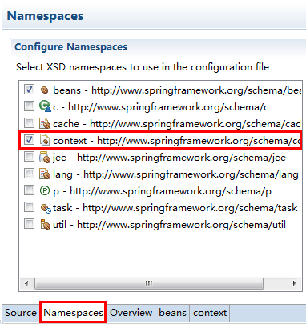

# 012.配置Bean（注解）

* 加入spring-aop-4.3.3.RELEASE.jar

## 一、特定组件注解

* 组件扫描（component scanning）：Spring能够从classpath下自动扫描，侦测和实例化具有特定注解的组件

* 对于扫描到的组件，Spring有默认的命名策略：使用非限定类名，第一个字母小写。也可以在注解中通过value属性指定组件的名称。

### @Component：基本注解，标识一个受Spring管理的组件

		package com.jimmy.spring.beans.annotation;
		
		import org.springframework.stereotype.Component;
		
		@Component
		public class TestObject {
			
		}

### @Repository：标识持久层组件

		package com.jimmy.spring.beans.annotation.repository;
		
		public interface UserRepository {
			void save();
		}
		
		package com.jimmy.spring.beans.annotation.repository;
		
		import org.springframework.stereotype.Repository;
		
		@Repository("userRepository")
		public class UserRepositoryImpl implements UserRepository {
		
			@Override
			public void save() {
				System.out.println("UserRepository save()...");
		
			}
		
		}

### @Service：标识业务层组件

		package com.jimmy.spring.beans.annotation.service;
		
		import org.springframework.stereotype.Service;
		
		@Service
		public class UserService {
			
			public void add(){
				System.out.println("UserService add()..");
			}
			
		}

### @Controller：标识控制器组件

		package com.jimmy.spring.beans.annotation.controller;
		
		import org.springframework.stereotype.Controller;
		
		@Controller
		public class UserController {
			
			public void execute(){
				System.out.println("UserController execute()...");
			}
			
		}

## 二、Spring Bean 配置文件

* 添加context命名空间

* 组件扫描

		<!-- 
			在组件类上使用了特定的注解之后，还需要在Spring的配置文件中配置组件扫描<context:component-scan>
			base-package属性指定需要扫描的基包，Spring容器将会扫描基包及其子包里的所有类
		-->
		<context:component-scan 
			base-package="com.jimmy.spring.beans.annotation">
		</context:component-scan>

* 通过包过滤

		<!-- 如果仅希望扫描特定的类而非基包下的所有类，可以使用resource-pattern属性进行指定 -->
		<context:component-scan 
			base-package="com.jimmy.spring.beans.annotation"
			resource-pattern="repository/*.class">
		</context:component-scan>
		
* 通过组件注解过滤

		<!-- <content:exclude-filter>子节点指定不扫描的组件注解 -->
		<context:component-scan 
			base-package="com.jimmy.spring.beans.annotation">
			<context:exclude-filter type="annotation" 
				expression="org.springframework.stereotype.Repository"/>
		</context:component-scan>
		
		<!-- 
			<content:include-filter>子节点指定扫描的组件注解
			要与use-default-filters属性配合使用
		-->
		<context:component-scan 
			base-package="com.jimmy.spring.beans.annotation"
			use-default-filters="false">
			<context:include-filter type="annotation" 
				expression="org.springframework.stereotype.Repository"/>
		</context:component-scan>

* 通过类和接口过滤

			<!-- <content:exclude-filter>子节点指定不扫描的类或接口 -->
			<context:component-scan 
				base-package="com.jimmy.spring.beans.annotation">
				<context:exclude-filter type="assignable" 
					expression="com.jimmy.spring.beans.annotation.repository.UserRepository"/>
			</context:component-scan>
			
			<!-- 
				<content:include-filter>子节点指定扫描的类或接口
				要与use-default-filters属性配合使用
			-->
			<context:component-scan 
				base-package="com.jimmy.spring.beans.annotation"
				use-default-filters="false">
				<context:include-filter type="annotation" 
					expression="com.jimmy.spring.beans.annotation.repository.UserRepository"/>
			</context:component-scan>

\<context:component-scan\>下可以有多个\<context:include-filter\>和\<content:exclude-filter\>子节点