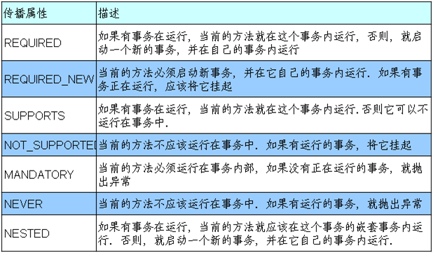
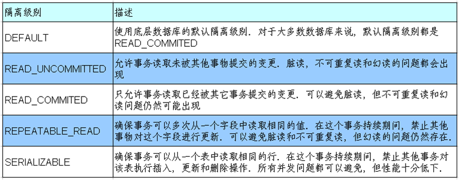

# 020.Spring事务管理

## 一、事务简介

* 事务管理是企业级应用程序开发中必不可少的技术, 用来确保数据的完整性和一致性. 

* 事务就是一系列的动作, 它们被当做一个单独的工作单元. 这些动作要么全部完成, 要么全部不起作用

* 事务的四个关键属性(ACID)
* 1.原子性(atomicity): 事务是一个原子操作, 由一系列动作组成. 事务的原子性确保动作要么全部完成要么完全不起作用.
* 2.一致性(consistency): 一旦所有事务动作完成, 事务就被提交. 数据和资源就处于一种满足业务规则的一致性状态中.
* 3.隔离性(isolation): 可能有许多事务会同时处理相同的数据, 因此每个事物都应该与其他事务隔离开来, 防止数据损坏.
* 4.持久性(durability): 一旦事务完成, 无论发生什么系统错误, 它的结果都不应该受到影响. 通常情况下, 事务的结果被写到持久化存储器中.

## 二、准备

* Dao

		package com.jimmy.spring.tx;
		
		import org.springframework.beans.factory.annotation.Autowired;
		import org.springframework.jdbc.core.JdbcTemplate;
		import org.springframework.stereotype.Repository;
		
		@Repository("bookShopDao")
		public class BookShopDaoImpl implements BookShopDao {
		
			@Autowired
			private JdbcTemplate jdbcTemplate;
			
			@Override
			public int findBookPriceByIsbn(String isbn) {
				String sql = "SELECT price FROM book where isbn = ?";
				int price = jdbcTemplate.queryForObject(sql, Integer.class, isbn);
				return price;
			}
		
			@Override
			public void updateBookStock(String isbn) {
				int stock = findBookStockByIsbn(isbn);
				if (stock == 0){
					throw new BookStockException("库存不足");
				}
				
				String sql = "UPDATE book_stock SET stock = stock-1 WHERE isbn = ?";
				jdbcTemplate.update(sql, isbn);
			}
		
			@Override
			public void updateAccount(String username, int price) {
				int balance = findUsernameBalanceByUsername(username);
				if (balance < price){
					throw new UserAccountException("余额不足");
				}
				
				String sql = "UPDATE account SET balance = balance-? WHERE username = ?";
				jdbcTemplate.update(sql, price, username);
			}
			
			public int findBookStockByIsbn(String isbn){
				String sql = "SELECT stock FROM book_stock where isbn = ?";
				int stock = jdbcTemplate.queryForObject(sql, Integer.class, isbn);
				return stock;
			}
			
			public int findUsernameBalanceByUsername(String username){
				String sql = "SELECT balance FROM account where username = ?";
				int balance = jdbcTemplate.queryForObject(sql, Integer.class, username);
				return balance;
			}
		
		}

* Service

		package com.jimmy.spring.tx;
		
		import org.springframework.beans.factory.annotation.Autowired;
		import org.springframework.stereotype.Service;
		
		@Service("bookShopService")
		public class BookShopServiceImpl implements BookShopService {
		
			@Autowired
			private BookShopDao bookShopDao; 
			
			@Override
			public void purchase(String isbn, String username) {
				//查询书的价格
				int price = bookShopDao.findBookPriceByIsbn(isbn);
				//更新书的库存
				bookShopDao.updateBookStock(isbn);
				//更新用户余额
				bookShopDao.updateAccount(username, price);
			}
		}

* Spring Bean配置文件

		<context:component-scan base-package="com.jimmy.spring.tx"></context:component-scan>
	
		<context:property-placeholder location="classpath:db.properties"/>
		
		<bean id="dataSource" class="com.mchange.v2.c3p0.ComboPooledDataSource">
			<property name="user" value="${user}"></property>
			<property name="password" value="${password}"></property>
			<property name="driverClass" value="${driverClass}"></property>
			<property name="jdbcUrl" value="${jdbcUrl}"></property>
			
			<property name="initialPoolSize" value="${initialPoolSize}"></property>
			<property name="maxPoolSize" value="${maxPoolSize}"></property>
		</bean>
		
		<bean id="jdbcTemplate" class="org.springframework.jdbc.core.JdbcTemplate">
			<constructor-arg ref="dataSource"></constructor-arg>
		</bean>

## 三、Spring中的事务管理

* 作为企业级应用程序框架, Spring 在不同的事务管理 API 之上定义了一个抽象层. 而应用程序开发人员不必了解底层的事务管理 API, 就可以使用 Spring 的事务管理机制.

* Spring 既支持编程式事务管理, 也支持声明式的事务管理.

* 编程式事务管理: 将事务管理代码嵌入到业务方法中来控制事务的提交和回滚. 在编程式管理事务时, 必须在每个事务操作中包含额外的事务管理代码.

 
* 声明式事务管理: 大多数情况下比编程式事务管理更好用. 它将事务管理代码从业务方法中分离出来, 以声明的方式来实现事务管理. 事务管理作为一种横切关注点, 可以通过 AOP 方法模块化. Spring 通过 Spring AOP 框架支持声明式事务管理.

* Spring 从不同的事务管理 API 中抽象了一整套的事务机制. 开发人员不必了解底层的事务 API, 就可以利用这些事务机制. 有了这些事务机制, 事务管理代码就能独立于特定的事务技术了.

* Spring 的核心事务管理抽象是它为事务管理封装了一组独立于技术的方法. 无论使用 Spring 的哪种事务管理策略(编程式或声明式), 事务管理器都是必须的.

## 四、声明式事务管理

* Spring配置文件

		<!-- 配置事务管理器 -->
		<bean id="transactionManager" 
			class="org.springframework.jdbc.datasource.DataSourceTransactionManager">
			<property name="dataSource" ref="dataSource"></property>
		</bean>
		
		<!-- 启用事务注解 -->
		<tx:annotation-driven transaction-manager="transactionManager"/>

* 事务注解

		@Transactional
		public void purchase(String isbn, String username) {

## 五、事务的传播属性

* 当事务方法被另一个事务方法调用时, 必须指定事务应该如何传播. 例如: 方法可能继续在现有事务中运行, 也可能开启一个新事务, 并在自己的事务中运行.

* 事务的传播行为可以由@Transactional注解的propagation属性指定.Spring定义了7种类传播行为.

* 设置事务的传播属性REQUIRED和REQUIRES_NEW

		package com.jimmy.spring.tx;
		
		import java.util.List;
		
		import org.springframework.beans.factory.annotation.Autowired;
		import org.springframework.stereotype.Service;
		import org.springframework.transaction.annotation.Propagation;
		import org.springframework.transaction.annotation.Transactional;
		
		@Service("cashier")
		public class CashierImpl implements Cashier {
		
			@Autowired
			private BookShopService bookShopService;
			
			/*
			 * 当 bookShopService的 purchase()方法被另一个事务方法 checkout()调用时, 
			 * 它默认会在现有的事务内运行. 这个默认的传播行为就是 REQUIRED. 
			 * 因此在 checkout()方法的开始和终止边界内只有一个事务. 这个事务只在 checkout()方法结束的时候被提交.
			 * 
			 * 另一种常见的传播行为是 REQUIRES_NEW. 
			 * 它表示该方法必须启动一个新事务, 并在自己的事务内运行. 如果有事务在运行, 就应该先挂起它.
			*/
			@Override
			@Transactional(propagation=Propagation.REQUIRED)
			public void checkout(List<String> isbns, String username) {
				for (String isbn : isbns) {
					bookShopService.purchase(isbn, username);
				}
			}
		
		}

# 六、事务的隔离属性

## 并发事务所导致的问题

* 当同一个应用程序或者不同应用程序中的多个事务在同一个数据集上并发执行时, 可能会出现许多意外的问题

* 并发事务所导致的问题可以分为下面三种类型:

* 1.脏读: 对于两个事物 T1, T2, T1  读取了已经被 T2 更新但 还没有被提交的字段. 之后, 若 T2 回滚, T1读取的内容就是临时且无效的.

* 2.不可重复读:对于两个事物 T1, T2, T1  读取了一个字段, 然后 T2 更新了该字段. 之后, T1再次读取同一个字段, 值就不同了.

* 3.幻读:对于两个事物 T1, T2, T1  从一个表中读取了一个字段, 然后 T2 在该表中插入了一些新的行. 之后, 如果 T1 再次读取同一个表, 就会多出几行.

## 事务的隔离级别

* 从理论上来说, 事务应该彼此完全隔离, 以避免并发事务所导致的问题. 然而, 那样会对性能产生极大的影响, 因为事务必须按顺序运行. 

* 在实际开发中, 为了提升性能, 事务会以较低的隔离级别运行.

* 事务的隔离级别可以通过隔离事务属性指定

* 事务的隔离级别要得到底层数据库引擎的支持, 而不是应用程序或者框架的支持.

* Oracle 支持的 2 种事务隔离级别：READ_COMMITED , SERIALIZABLE

* Mysql 支持 4 中事务隔离级别.

## 设置事务的隔离属性

* @Transactional注解的isolation属性中设置隔离级别

# 七、事务的回滚属性

* 默认情况下只有未检查异常(RuntimeException和Error类型的异常)会导致事务回滚. 而受检查异常不会.

* 事务的回滚规则可以通过@Transactional注解的 rollbackFor和 noRollbackFor属性来设置. 这两个属性被声明为 Class[] 类型的, 因此可以为这两个属性指定多个异常类.
* --rollbackFor:  遇到时必须进行回滚
* --noRollbackFor: 一组异常类，遇到时必须不回滚

# 八、事务的超时和只读属性

* 由于事务可以在行和表上获得锁, 因此长事务会占用资源, 并对整体性能产生影响. 

* 如果一个事物只读取数据但不做修改, 数据库引擎可以对这个事务进行优化.

* 超时事务属性: 事务在强制回滚之前可以保持多久. 这样可以防止长期运行的事务占用资源.

* 只读事务属性: 表示这个事务只读取数据但不更新数据, 这样可以帮助数据库引擎优化事务.

* 超时属性timeout和只读属性readOnly可以在@Transactional注解中设置.超时属性以秒为单位来计算.

